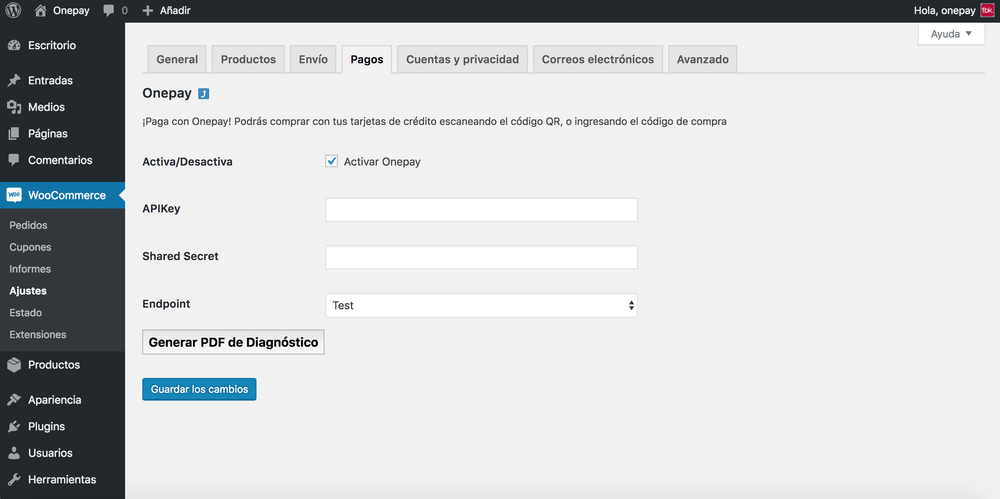

# Manual de instalación para Plugin WooCommerce

## Descripción

Este plugin oficial ha sido creado para que puedas integrar Onepay fácilmente en tu comercio, basado en WooCommerce.

## Requisitos

Ud. debe tener instalado previamente Wordpress, y WooCommerce.

## Instalación de Plugin

1. Dirígete a [https://github.com/TransbankDevelopers/transbank-plugin-woocommerce-onepay/releases](https://github.com/TransbankDevelopers/transbank-plugin-woocommerce-onepay/releases), y descargue la última versión disponible del plugin.

  Una vez descargado el plugin, ingrese a la página de administración de Wordpress (usualmente en _misitio.com_/wp-admin), y dirígete a Plugins, Añadir nuevo, indicado a continuación:

  
  
2. Haz click sobre el botón "Subir plugin", y selecciona el archivo que descargaste en el paso anterior. Luego de eso, presiona el botón "Instalar Ahora".

  
  
3. Una vez realizado el paso anterior, Wordpress realizará la instalación del plugin Onepay. Cuando finalice, debes activar el plugin haciendo click en el botón "Activar plugin".

  

## Configuración

Este plugin posee un sitio de configuración que te permitirá ingresar credenciales que Transbank te otorgará, y además podrás generar un documento de diagnóstico en caso que Transbank te lo pida.

Para acceder a la configuración, debes seguir los siguientes pasos:

1. Dirígete a la página de administración de Wordpress (usualmente en _misitio.com_/wp-admin), y luego anda a WooCommerce, Ajustes.

  

2. Llegarás a la página de configuración de WooCommerce, ahora debes hacer click en "Pagos".

  
  
3. En esta pantalla podrás ver todos los medios de pago disponibles.  Busca el plugin "Onepay", y haz click sobre el título.

  

4. ¡Ya está! Estás en la pantalla de configuración del plugin, debes ingresar la siguiente información:
  * **Activar Onepay**: Al activarlo, Onepay estará disponible como medio de pago. Ten la precaución de que se encuentre marcada esta opción cuando quieras que los usuarios paguen con Onepay.
  * **APIKey**: Es lo que te identifica como comercio.
  * **Shared Secret**: Llave secreta que te autoriza y valida a hacer transacciones.
  * **Endpoint**: Ambiente hacia donde se realiza la transacción. 

  Las opciones disponibles para _Endpoint_ son: "Integración" para realizar pruebas y certificar la instalación con Transbank, y "Producción" para hacer transacciones reales una vez que Transbank ha aprobado el comercio.
  
  Además, puedes generar un documento de diagnóstico en caso que Transbank te lo pida. Para ello, haz click en "Generar PDF de Diagnóstico", y automáticamente se descargará dicho documento.

  
